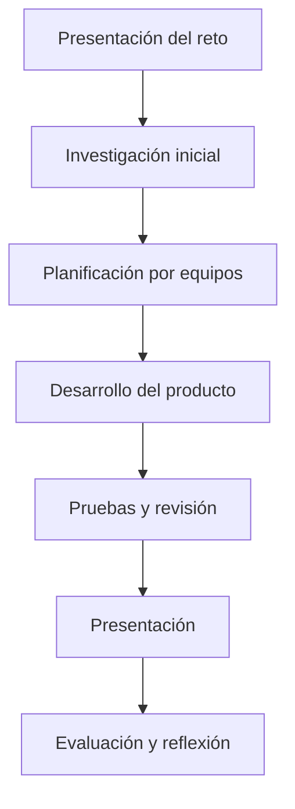

# Guía docente

Esta carpeta resume cómo aplicar el proyecto en el aula. Debe permitir que otro docente entienda rápidamente qué se va a hacer, con qué recursos, en cuánto tiempo y qué papel tendrá el alumnado.

## Descripción breve

#TODO Explicar el proyecto en un párrafo claro. Conviene responder a estas preguntas:

- ¿qué reto se plantea?;
- ¿qué producto final se espera?;
- ¿qué contenidos o saberes se trabajan?;
- ¿qué metodología activa se usa?;
- ¿qué recursos se necesitan?

## Perfil del grupo

| Aspecto | Descripción |
| --- | --- |
| Nivel educativo | #TODO Indicar nivel. |
| Materia | #TODO Indicar materia. |
| Conocimientos previos | #TODO Indicar qué debe saber el alumnado antes de empezar. |
| Agrupamientos | #TODO Indicar trabajo individual, parejas, equipos o grupos cooperativos. |
| Atención a la diversidad | #TODO Indicar medidas de apoyo, ampliación o adaptación. |

## Papel del docente

El docente actúa como diseñador de la experiencia, guía del proceso, facilitador de recursos y responsable de la evaluación formativa.

#TODO Añadir orientaciones específicas sobre:

- cuándo explicar conceptos nuevos;
- cuándo dejar autonomía al alumnado;
- cómo resolver dudas sin sustituir el trabajo del equipo;
- cómo registrar evidencias durante el proceso;
- qué errores frecuentes pueden aparecer.

## Secuencia recomendada

## Preparación previa

- #TODO Preparar materiales físicos o digitales.
- #TODO Revisar funcionamiento de herramientas o plataformas.
- #TODO Crear equipos de trabajo y roles.
- #TODO Preparar rúbricas y plantillas.
- #TODO Decidir qué evidencias se recogerán.

## Recomendaciones de uso

- Mantén la pregunta guía visible durante todo el proyecto.
- Entrega la rúbrica desde el inicio.
- Reserva momentos de revisión intermedia.
- Documenta tanto los aciertos como los errores.
- Incluye una presentación pública, aunque sea dentro del propio grupo-clase.

