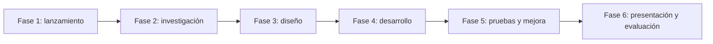

# Diseño didáctico

Esta carpeta define el proyecto como ABP. Aquí se explica qué se va a aprender, cómo se organiza el trabajo y qué decisiones didácticas sostienen la propuesta.

## Elementos esenciales del ABP

| Elemento | Cómo se concreta en este proyecto |
| --- | --- |
| Contenido significativo | #TODO Indicar qué saberes importantes se trabajan en profundidad. |
| Necesidad de saber | #TODO Explicar qué actividad inicial despierta curiosidad. |
| Pregunta guía | #TODO Escribir la pregunta guía. |
| Autonomía del alumnado | #TODO Indicar qué decisiones podrán tomar los equipos. |
| Investigación | #TODO Explicar qué deberán buscar, analizar o comprobar. |
| Producto final | #TODO Describir el producto. |
| Revisión y mejora | #TODO Indicar momentos de retroalimentación. |
| Presentación pública | #TODO Indicar audiencia y formato de difusión. |
| Evaluación | #TODO Indicar instrumentos principales. |

## Objetivos didácticos

- #TODO Objetivo 1.
- #TODO Objetivo 2.
- #TODO Objetivo 3.
- #TODO Objetivo 4.
- #TODO Objetivo 5.

## Fases del proyecto

| Fase | Finalidad | Evidencia |
| --- | --- | --- |
| Lanzamiento | #TODO Presentar el reto y activar conocimientos previos. | #TODO |
| Investigación | #TODO Buscar información y definir necesidades. | #TODO |
| Diseño | #TODO Planificar la solución. | #TODO |
| Desarrollo | #TODO Construir, programar, redactar o crear el producto. | #TODO |
| Pruebas y mejora | #TODO Revisar y corregir. | #TODO |
| Presentación | #TODO Comunicar resultados. | #TODO |

## Roles de equipo

#TODO Adaptar los roles al proyecto. Algunos ejemplos:

- coordinación;
- documentación;
- diseño técnico;
- control de materiales;
- comunicación;
- revisión de calidad.

## Atención a la diversidad

#TODO Indicar apoyos, andamiajes, opciones de ampliación y posibles adaptaciones. Conviene incluir tareas con diferentes niveles de complejidad.

