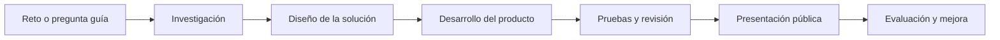

# Título del proyecto ABP

Repositorio plantilla para documentar, compartir y reutilizar un proyecto educativo basado en Aprendizaje Basado en Proyectos.

> Sustituye este texto por el título definitivo del proyecto. Debe ser claro, concreto y comprensible para otro docente que llegue al repositorio desde GitHub.

## Resumen

#TODO Redactar un resumen de entre 8 y 12 líneas que explique:

- qué problema, pregunta o reto aborda el proyecto;
- a qué nivel educativo y materia se dirige;
- qué producto final elaborará el alumnado;
- qué metodología activa se emplea;
- qué herramientas, materiales o recursos principales se utilizarán;
- cómo se evaluará el proceso y el producto final.

## Datos básicos

| Campo | Información |
| --- | --- |
| Etapa educativa | #TODO Indicar etapa. |
| Curso | #TODO Indicar curso. |
| Materia o ámbito | #TODO Indicar materia. |
| Metodología principal | Aprendizaje Basado en Proyectos. |
| Duración estimada | #TODO Indicar número de sesiones o semanas. |
| Producto final | #TODO Describir el producto tangible o presentación final. |
| Herramientas principales | #TODO Indicar herramientas digitales, materiales o plataformas. |
| Autoría | #TODO Indicar autor, centro o equipo docente. |

## Pregunta guía

> #TODO Formular una pregunta abierta, contextualizada y motivadora.

Una buena pregunta guía debe conectar con una situación real, permitir varias respuestas posibles y exigir investigación, diseño, toma de decisiones y comunicación de resultados.

## Estructura del repositorio

| Carpeta | Finalidad |
| --- | --- |
| [`00-guia-docente`](00-guia-docente/) | Orientaciones generales para aplicar el proyecto en el aula. |
| [`01-contexto-y-justificacion`](01-contexto-y-justificacion/) | Contexto educativo, justificación pedagógica y relación curricular. |
| [`02-diseno-didactico`](02-diseno-didactico/) | Diseño ABP: reto, objetivos, saberes, competencias, fases y roles. |
| [`03-sesiones`](03-sesiones/) | Desarrollo sesión a sesión o por bloques de trabajo. |
| [`04-materiales-alumnado`](04-materiales-alumnado/) | Guías, plantillas, fichas y documentos para el alumnado. |
| [`05-materiales-docente`](05-materiales-docente/) | Solucionarios, orientaciones y recursos internos del docente. |
| [`06-evaluacion`](06-evaluacion/) | Rúbricas, listas de cotejo, autoevaluación y coevaluación. |
| [`07-recursos-tecnicos`](07-recursos-tecnicos/) | Código, esquemas, imágenes, enlaces, materiales y archivos técnicos. |
| [`08-resultados-y-evidencias`](08-resultados-y-evidencias/) | Ejemplos de productos, evidencias, fotografías, capturas y memoria final. |
| [`09-mejoras-y-reutilizacion`](09-mejoras-y-reutilizacion/) | Adaptaciones, ampliaciones y notas para reutilizar el proyecto. |

## Cómo usar esta plantilla

1. Descarga o copia este repositorio.
2. Cambia el título y los datos básicos.
3. Completa primero la pregunta guía, el producto final y la planificación.
4. Rellena cada carpeta con la documentación del proyecto.
5. Sustituye los `#TODO` por información concreta.
6. Añade imágenes, esquemas, enlaces y archivos reales cuando estén disponibles.
7. Revisa ortografía, enlaces y coherencia antes de publicar.

Consulta también la guía [`COMO-USAR-LA-PLANTILLA.md`](COMO-USAR-LA-PLANTILLA.md).

## Diagrama general del proyecto

## Licencia

#TODO Indicar la licencia del proyecto. Para recursos educativos abiertos se puede considerar una licencia Creative Commons, por ejemplo CC BY o CC BY-SA.
